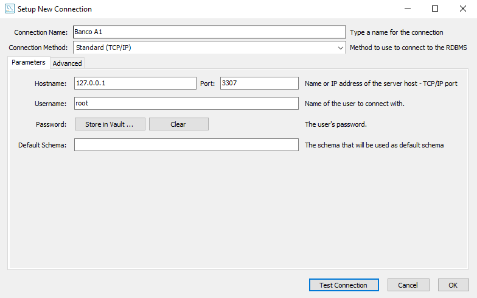
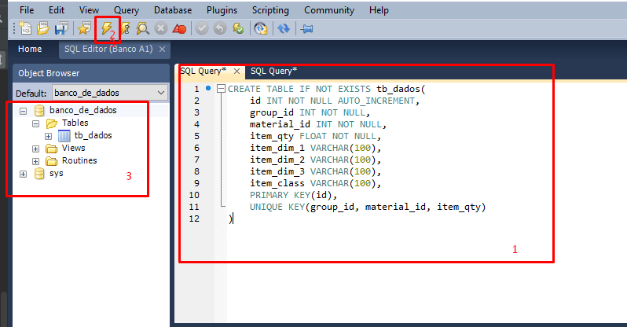
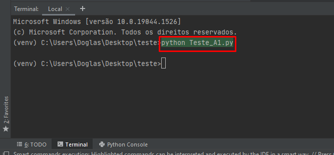
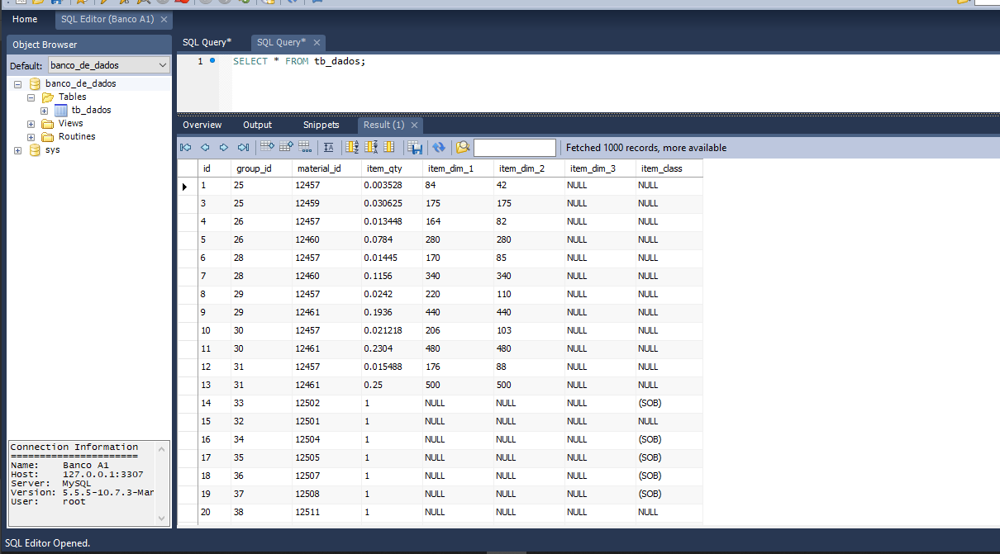

#Teste A1
Programa em python para tratar dados de um CSV e inseri-los no banco

### Configurações iniciais e Instalações:

* Instalar o python 3.8.

https://www.python.org/ftp/python/3.8.0/python-3.8.0-amd64.exe

**Obs: Não esqueça de adicionar o python do path do windows na hora da instalação.**

* Instalar o Git.

https://github.com/git-for-windows/git/releases/download/v2.35.1.windows.2/Git-2.35.1.2-64-bit.exe

* Instalar o server do MariaDB na porta 3307.

https://espejito.fder.edu.uy/mariadb/mariadb-10.7.3/winx64-packages/mariadb-10.7.3-winx64.msi

* Instalar o Workbench do Mysql para configuração das tabelas do banco.

https://dev.mysql.com/downloads/file/?id=509428

* Instalar o Driver de conexão ao banco 'MySQL ODBC 3.51 Driver'.

https://downloads.mysql.com/archives/get/p/10/file/mysql-connector-odbc-3.51.30-winx64.msi

* Clonar o diretório do git.

Executar o comando no console (cmd):
```
git clone https://github.com/Doglas-Anjos/Teste_A1.git
```
* Criar uma venv do python nesse diretório.

* Instalar os requirements.txt na venv criada no passo anterior.

```
pip install -r requirements.txt
```
* Configurar no Workbench uma ``` Nova Conexão```:



* Copiar o conteúdo do arquivo ```Create_data_base.sql``` no Sql Query do Workbench, executar e verificar a criação do banco!



* Executar o Script em python no diretório que está o projeto:



* No Sql Query executar o comando abaixo para verificar a inserção dos dados no banco.

```
SELECT * FROM tb_dados;
```

